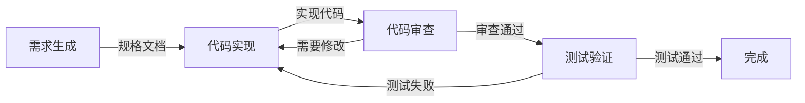
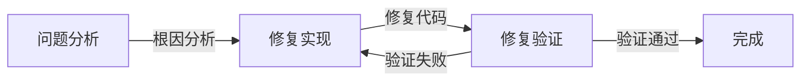

# Claude Code 需求驱动与错误修复工作流

[](https://opensource.org/licenses/MIT)
[](https://claude.ai/code)
[](https://github.com/)

> 轻量级需求驱动开发与系统化错误修复工作流

[English](README.md)

## 🚀 概览

本项目提供两个核心工作流，专注于实用性和效率：

1. **Requirements-Pilot** - 需求驱动开发工作流
2. **Bugfix** - 系统化错误修复工作流

两个工作流都集成了 **Codex MCP**，确保所有后端代码生成统一、高质量、可追踪。

---

## 🏭 Requirements-Pilot 工作流

轻量级需求驱动开发工作流，适用于快速实现和迭代。

### 一条命令启动

```bash
/requirements-pilot "实现 JWT 用户认证系统"
# 自动化：需求生成 → 代码实现 → 代码审查 → 测试验证
```

### 工作流架构



### 核心特性

- **🎯 需求优先**：自动生成详细技术规格
- **🧠 Codex 后端**：所有后端/API/数据库开发强制使用 Codex MCP
- **✅ 质量门控**：90% 质量阈值自动优化
- **📁 持久化**：所有文档保存至 `.claude/specs/`
- **🔄 迭代优化**：自动改进直至质量达标
- **🧪 测试驱动**：功能测试和集成测试

### 智能体角色

| 智能体 | 职责 | 输出 |
|--------|------|------|
| **requirements-generate** | 分析需求并生成技术规格 | `requirements-spec.md` |
| **requirements-code** | 实现功能（前端整合 + Codex 后端） | 源代码文件 |
| **requirements-review** | 功能性和集成性审查 | `codex-review.md` |
| **requirements-testing** | 功能验证和集成测试 | `test-report.md` |

### 工作流产物

每次运行创建结构化文档：

```
.claude/specs/jwt-authentication/
├── 00-repo-scan.md           # 仓库扫描分析
├── requirements-spec.md      # 技术规格文档
├── 02-architecture.md        # 系统架构（standard/full；minimal 模式嵌入在 brief 中）
├── codex-backend.md          # Codex 后端实现日志
├── codex-output.json         # Codex 输出数据
├── codex-review.md           # 代码审查报告
└── test-report.md           # 测试验证报告
```

### 使用示例

```bash
# 基本用法
/requirements-pilot "添加邮件通知功能"

# 快速原型（跳过测试）
/requirements-pilot "用户个人资料页面" --skip-tests

# 使用现有上下文（跳过仓库扫描）
/requirements-pilot "修复登录问题" --skip-scan
```

---

## 🐛 Bugfix 工作流

系统化的错误修复流程，确保修复质量和回归预防。

### 一条命令启动

```bash
/bugfix "用户登录时返回 500 错误"
# 自动化：问题分析 → 修复实现 → 修复验证
```

### 工作流架构



### 核心特性

- **🔍 根因分析**：系统化问题分析
- **🧠 Codex 后端修复**：后端 bug 强制使用 Codex MCP
- **🧪 修复验证**：独立验证修复质量
- **📊 回归预防**：确保不引入新问题
- **📝 完整文档**：记录问题和解决方案

### 智能体角色

| 智能体 | 职责 | 输出 |
|--------|------|------|
| **bugfix** | 分析问题并实现修复 | 修复代码 + `bugfix-log.md` |
| **bugfix-verify** | 独立验证修复质量 | `verification-report.md` |

### 工作流产物

```
.claude/specs/login-500-error/
├── 00-repo-scan.md           # 仓库上下文
├── bugfix-log.md            # 问题分析和修复日志
├── codex-backend.md          # Codex 后端修复日志（如适用）
├── codex-output.json         # Codex 输出数据（如适用）
└── verification-report.md   # 修复验证报告
```

### 使用示例

```bash
# 基本用法
/bugfix "用户无法上传头像，控制台显示 CORS 错误"

# 后端 bug 修复（自动调用 Codex）
/bugfix "API 接口返回 500 错误"

# 性能问题修复
/bugfix "列表页面加载缓慢，需要 5 秒以上"
```

---

## 🧠 Codex MCP 集成

两个工作流都强制使用 Codex MCP 处理所有后端代码生成。

### 自动 Codex 调用场景

**后端开发**：
- RESTful API 端点
- GraphQL resolvers
- 数据库操作（ORM 模型、迁移脚本、查询）
- 业务逻辑实现
- 中间件和服务

**后端 Bug 修复**：
- API/服务器错误
- 数据库查询问题
- 性能问题
- 后端逻辑错误

### Codex 输出文档

每次 Codex 调用生成两个文件：

1. **codex-backend.md** - 实现日志
   - 任务摘要
   - 修改文件列表
   - 技术决策
   - 审查问题

2. **codex-output.json** - 结构化数据
   - 任务完成状态
   - 测试覆盖率
   - 变更摘要
   - 自检清单

---

## 🚀 快速开始

### 安装

```bash
# 克隆仓库
git clone https://github.com/your-repo/requirements-pilot-only.git
cd requirements-pilot-only

# 使用 make 安装
make install
```

### 基本使用

```bash
# 需求驱动开发
/requirements-pilot "实现用户注册功能，支持邮箱验证"

# 错误修复
/bugfix "用户注册后收不到验证邮件"
```

---

## 📊 质量保证

### 需求规格质量（90% 阈值）

- **功能完整性**：清晰的功能需求
- **技术细节**：实现指导充分
- **集成规范**：接口和数据流定义
- **测试标准**：验收标准明确

### 代码审查标准

- **功能性**：实现是否符合需求
- **集成质量**：与现有代码的整合
- **可维护性**：代码清晰度和结构
- **测试覆盖**：关键路径测试

### Bug 修复质量

- **根因分析**：问题原因明确
- **修复有效性**：问题完全解决
- **回归预防**：无新问题引入
- **测试验证**：修复经过验证

---

## 🔧 高级特性

### 仓库上下文感知

两个工作流都会自动扫描仓库以了解：
- 技术栈和框架
- 项目结构和组织
- 现有代码模式
- 依赖关系
- 编码规范

### 迭代优化

质量不达标时自动优化：

```
生成器: "需求规格完成（质量：75/90）"
系统: "质量未达标，自动优化中..."
生成器: "优化后的规格（质量：92/90）✅"
```

### 持久化规格

所有工作流产物保存在 `.claude/specs/` 目录，按功能或问题分类：

```
.claude/specs/
├── user-registration/        # Requirements-pilot 产物
│   ├── 00-repo-scan.md
│   ├── requirements-spec.md
│   ├── 02-architecture.md
│   ├── codex-backend.md
│   ├── codex-review.md
│   └── test-report.md
└── email-verification-bug/   # Bugfix 产物
    ├── 00-repo-scan.md
    ├── bugfix-log.md
    ├── codex-backend.md
    └── verification-report.md
```

---

## 📄 文件结构

```
.
├── CLAUDE.md              # 核心配置（Agent 边界 + Codex 规则）
├── Makefile              # 部署和安装脚本
├── README.md             # 英文文档
├── README-zh.md          # 中文文档（本文件）
├── agents/               # 智能体定义
│   ├── bugfix.md
│   ├── bugfix-verify.md
│   ├── requirements-code.md
│   ├── requirements-generate.md
│   ├── requirements-review.md
│   └── requirements-testing.md
└── commands/             # 斜杠命令
    ├── bugfix.md
    └── requirements-pilot.md
```

---

## 🛠️ Make 命令

```bash
make install              # 安装所有配置到 Claude Code
make deploy-requirements  # 仅部署 Requirements 工作流
make deploy-bugfix        # 仅部署 Bugfix 工作流
make clean               # 清理生成的产物
make help                # 显示所有可用命令
```

---

## 📄 许可证

MIT 许可证 - 查看 [LICENSE](LICENSE) 文件

---

## 🙋 支持

- **文档**：查看 `/commands/` 和 `/agents/` 目录
- **问题反馈**：GitHub issues
- **Makefile 帮助**：运行 `make help`

---

**用需求驱动开发，用系统化修复错误** - 简单、实用、高质量。

*Codex 处理后端，你专注业务逻辑。*
