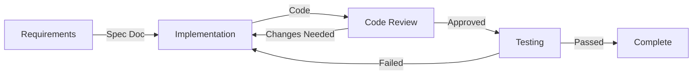
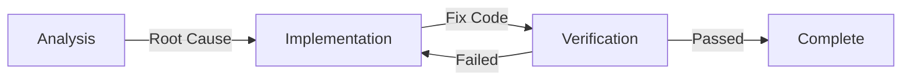

# Spec-to-Code: Requirements-Driven Development & Bugfix Workflows

[](https://opensource.org/licenses/MIT)
[](https://claude.ai/code)
[](https://github.com/yourusername/spec-to-code)

> Lightweight requirements-driven development and systematic bug fixing workflows

[中文](README-zh.md)

## 🚀 Overview

This project provides two core workflows focused on practicality and efficiency:

1. **Requirements-Pilot** - Requirements-driven development workflow
2. **Bugfix** - Systematic bug resolution workflow

Both workflows integrate **Codex MCP** to ensure all backend code generation is unified, high-quality, and traceable.

---

## 🏭 Requirements-Pilot Workflow

A lightweight requirements-driven development workflow for rapid implementation and iteration.

### One Command Launch

```bash
/requirements-pilot "Implement JWT user authentication system"
# Automated: Requirements generation → Code implementation → Code review → Testing validation
```

### Workflow Architecture



### Key Features

- **🎯 Requirements-First**: Automatically generates detailed technical specifications
- **🧠 Codex Backend**: All backend/API/database development enforced through Codex MCP
- **🤖 Frontend Sub-Agent**: Dedicated requirements-code agent reads all artifacts before writing frontend/glue code
- **✅ Quality Gates**: 90% quality threshold with automatic optimization
- **📁 Persistent Artifacts**: All documents saved to `.claude/specs/`
- **🔄 Iterative Refinement**: Automatic improvement until quality met
- **🧪 Test-Driven**: Functional and integration testing

### Agent Roles

| Agent | Responsibility | Output |
|-------|----------------|--------|
| **requirements-generate** | Analyze requirements and generate technical specs | `requirements-spec.md` |
| **requirements-code** | Dedicated frontend/glue sub-agent that reads specs + Codex artifacts before coding | Source code files |
| **requirements-review** | Functionality and integration review | `codex-review.md` |
| **requirements-testing** | Functional validation and integration testing | `test-report.md` |

### Workflow Artifacts

Each run creates structured documentation:

```
.claude/specs/jwt-authentication/
├── 00-repo-scan.md           # Repository scan analysis
├── requirements-spec.md      # Technical specification
├── 02-architecture.md        # System architecture (standard/full; minimal embeds in brief)
├── codex-backend.md          # Codex backend implementation log + structured summary
├── codex-review.md           # Code review report
└── test-report.md           # Testing validation report
```

### Usage Examples

```bash
# Basic usage
/requirements-pilot "Add email notification feature"

# Quick prototype (skip testing)
/requirements-pilot "User profile page" --skip-tests

# Use existing context (skip repository scan)
/requirements-pilot "Fix login issue" --skip-scan
```

---

## 🐛 Bugfix Workflow

A systematic bug resolution process ensuring fix quality and regression prevention.

### One Command Launch

```bash
/bugfix "User login returns 500 error"
# Automated: Problem analysis → Fix implementation → Fix verification
```

### Workflow Architecture



### Key Features

- **🔍 Root Cause Analysis**: Systematic problem analysis
- **🧠 Codex Backend Fixes**: Backend bugs enforced through Codex MCP
- **🧪 Fix Verification**: Independent verification of fix quality
- **📊 Regression Prevention**: Ensures no new issues introduced
- **📝 Complete Documentation**: Records problems and solutions

### Agent Roles

| Agent | Responsibility | Output |
|-------|----------------|--------|
| **bugfix** | Analyze problem and implement fix | Fix code + `bugfix-log.md` |
| **bugfix-verify** | Independent verification of fix quality | `verification-report.md` |

### Workflow Artifacts

```
.claude/specs/login-500-error/
├── 00-repo-scan.md           # Repository context
├── bugfix-log.md            # Problem analysis and fix log
├── codex-backend.md          # Codex backend fix log (with structured summary, if applicable)
└── verification-report.md   # Fix verification report
```

### Usage Examples

```bash
# Basic usage
/bugfix "User cannot upload avatar, console shows CORS error"

# Backend bug fix (automatically calls Codex)
/bugfix "API endpoint returns 500 error"

# Performance issue fix
/bugfix "List page loads slowly, takes over 5 seconds"
```

---

## 🧠 Codex MCP Integration

Both workflows enforce Codex MCP for all backend code generation.

### Automatic Codex Call Scenarios

**Backend Development**:
- RESTful API endpoints
- GraphQL resolvers
- Database operations (ORM models, migrations, queries)
- Business logic implementation
- Middleware and services

**Backend Bug Fixes**:
- API/server errors
- Database query issues
- Performance problems
- Backend logic errors

### Codex Output Documentation

Each Codex call now generates a single implementation log, and **Codex must write it during the same run that produces the backend code**—other agents only verify its contents:

- **codex-backend.md** – Narrative log plus a `## Structured Summary` fenced JSON block
  - Narrative: task summary, modified files list, technical decisions, QA notes/questions
  - Structured Summary JSON: task completion status, tests/coverage, change packet, self-review flags

If the log or the structured block is missing/empty after a run, rerun Codex with the same prompt plus an explicit reminder to emit it—manual backfilling is reserved only for outages documented in the manifest.

### Context Attachment Best Practice

- When specs already live inside `.claude/specs/{feature_name}/`, attach the directory itself in the Codex prompt (e.g., `@.claude/specs/todo-list-app/`). Codex can crawl the folder and read whichever documents it needs, which eliminates redundant `Read` calls or giant pasted blobs.

---

## 🚀 Quick Start

### Installation

```bash
# Clone repository
git clone https://github.com/yourusername/spec-to-code.git
cd spec-to-code

# Install using make
make install
```

### Basic Usage

```bash
# Requirements-driven development
/requirements-pilot "Implement user registration with email verification"

# Bug fixing
/bugfix "User doesn't receive verification email after registration"
```

---

## 📊 Quality Assurance

### Requirements Spec Quality (90% Threshold)

- **Functional Completeness**: Clear functional requirements
- **Technical Details**: Sufficient implementation guidance
- **Integration Specs**: Interface and data flow definitions
- **Testing Standards**: Clear acceptance criteria

### Code Review Standards

- **Functionality**: Implementation meets requirements
- **Integration Quality**: Integration with existing code
- **Maintainability**: Code clarity and structure
- **Test Coverage**: Critical path testing

### Bug Fix Quality

- **Root Cause Analysis**: Problem cause clearly identified
- **Fix Effectiveness**: Problem completely resolved
- **Regression Prevention**: No new issues introduced
- **Test Verification**: Fix verified through testing

---

## 🔧 Advanced Features

### Repository Context Awareness

Both workflows automatically scan the repository to understand:
- Technology stack and frameworks
- Project structure and organization
- Existing code patterns
- Dependencies
- Coding conventions

### Iterative Optimization

Automatic optimization when quality is below threshold:

```
Generator: "Requirements spec complete (quality: 75/90)"
System: "Quality below threshold, optimizing..."
Generator: "Optimized spec (quality: 92/90) ✅"
```

### Persistent Specifications

All workflow artifacts saved in `.claude/specs/` directory, organized by feature or issue:

```
.claude/specs/
├── user-registration/        # Requirements-pilot artifacts
│   ├── 00-repo-scan.md
│   ├── requirements-spec.md
│   ├── 02-architecture.md
│   ├── codex-backend.md
│   ├── codex-review.md
│   └── test-report.md
└── email-verification-bug/   # Bugfix artifacts
    ├── 00-repo-scan.md
    ├── bugfix-log.md
    ├── codex-backend.md
    └── verification-report.md
```

---

## 📄 File Structure

```
.
├── CLAUDE.md              # Core configuration (Agent boundaries + Codex rules)
├── Makefile              # Deployment and installation scripts
├── README.md             # English documentation (this file)
├── README-zh.md          # Chinese documentation
├── agents/               # Agent definitions
│   ├── bugfix.md
│   ├── bugfix-verify.md
│   ├── requirements-code.md
│   ├── requirements-generate.md
│   ├── requirements-review.md
│   └── requirements-testing.md
└── commands/             # Slash commands
    ├── bugfix.md
    └── requirements-pilot.md
```

---

## 🛠️ Make Commands

```bash
make install              # Install all configurations to Claude Code
make deploy-requirements  # Deploy Requirements workflow only
make deploy-bugfix        # Deploy Bugfix workflow only
make clean               # Clean generated artifacts
make help                # Show all available commands
```

---

## 📄 License

MIT License - see [LICENSE](LICENSE) file

---

## 🙋 Support

- **Documentation**: Check `/commands/` and `/agents/` directories
- **Issue Tracking**: GitHub issues
- **Makefile Help**: Run `make help`

---

**Requirements-driven development, systematic bug fixing** - Simple, practical, high-quality.

*Codex handles the backend, you focus on business logic.*
