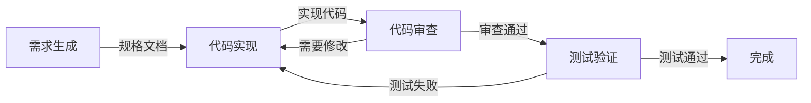

# Spec-to-Code: 需求驱动开发与错误修复工作流

[](https://opensource.org/licenses/MIT)
[](https://claude.ai/code)
[](https://github.com/yourusername/spec-to-code)

> 轻量级需求驱动开发与系统化错误修复工作流

[English](README.md)

## 🚀 概览

本项目提供两个核心工作流，专注于实用性和效率：

1. **Requirements-Pilot** - 需求驱动开发工作流
2. **Bugfix** - 系统化错误修复工作流

两个工作流都集成了 **Codex Skill**，确保所有后端代码生成统一、高质量、可追踪。

---

## 🏭 Requirements-Pilot 工作流

轻量级需求驱动开发工作流，适用于快速实现和迭代。

### 一条命令启动

```bash
/requirements-pilot "实现 JWT 用户认证系统"
# 自动化：需求生成 → 代码实现 → 代码审查 → 测试验证
```

### 工作流架构



### 核心特性

- **🎯 需求优先**：主智能体只用 sub-agent 生成初稿，之后手动澄清、修改、按 Rubric 评分，且每个阶段达到 ≥90 分并获得用户确认后才能继续
- **🧠 Codex 全程**：所有代码实现、审查、测试都由 Codex Skill 完成，保证一致性
- **🏗️ 架构护栏**：主智能体向用户口头确认极简架构骨架（不新增文档），再把经确认的骨架 + 需求 + 仓库上下文 @ 给 Codex 扩写完整架构
- **🔍 Codex 复核规格**：需求/架构文档在实现前由 Codex 复核，提出改进意见
- **✅ 质量门控**：90% 阈值 + 明确评分维度，严格禁止未确认假设
- **📁 持久化**：所有文档统一存放在 `.claude/specs/`
- **🔄 迭代优化**：自动循环澄清与修改，直到质量达标
- **🧪 测试驱动**：Codex 创建并执行测试用例

### 智能体角色

| 智能体 | 职责 | 输出 |
|--------|------|------|
| **requirements-generate** | 协调 sub-agent 产出首稿，主导澄清/评分循环，设计架构骨架并让 Codex 扩写，手动校验到 ≥90 分并征求用户确认 | `.claude/specs/{feature}/01-requirements.md`、`.claude/specs/{feature}/02-architecture.md` |
| **requirements-code** | 编排 Codex 完成全部代码与测试，实现 `codex-backend.md`（含结构化摘要）和必要的 `api-docs.md` | 代码改动 + Codex 文档 |
| **requirements-review** | 并行运行 Codex + sub-agent 审查，由主智能体合并结果评分，<90 时驱动 Codex 修复后重审 | `.claude/specs/{feature}/codex-review.md` |
| **requirements-testing** | 主智能体编排 Codex 运行/新增测试并记录结果 | `codex-backend.md`（测试部分）或 `dev-notes.md`（如需澄清） |

### 工作流产物

每次运行创建结构化文档：

```
.claude/specs/jwt-authentication/
├── 00-repo-scan.md        # 仓库扫描（若未跳过）
├── 01-requirements.md     # 需求文档（≥90，含评分与假设）
├── 02-architecture.md     # 架构文档（由 Codex 扩写后手动审校，≥90）
├── dev-notes.md           # 如 Codex 新增行为需说明
├── codex-backend.md       # Codex 实现日志 + Structured Summary JSON
├── api-docs.md            # 若有 API 变更由 Codex 输出
└── codex-review.md        # Codex 代码审查报告
```

### 使用示例

```bash
# 基本用法
/requirements-pilot "添加邮件通知功能"

# 快速原型（跳过测试）
/requirements-pilot "用户个人资料页面" --skip-tests

# 使用现有上下文（跳过仓库扫描）
/requirements-pilot "修复登录问题" --skip-scan
```

---

## 🐛 Bugfix 工作流

系统化的错误修复流程，确保修复质量和回归预防。

### 一条命令启动

```bash
/bugfix "用户登录时返回 500 错误"
# 自动化：问题分析 → 修复实现 → 修复验证
```

### 工作流架构


### 核心特性

- **🔍 根因分析**：系统化问题分析
- **🧠 Codex 后端修复**：后端 bug 强制使用 Codex Skill
- **🧪 修复验证**：独立验证修复质量
- **📊 回归预防**：确保不引入新问题
- **📝 完整文档**：记录问题和解决方案

### 智能体角色

| 智能体 | 职责 | 输出 |
|--------|------|------|
| **bugfix** | 分析问题并实现修复 | 修复代码 + `bugfix-log.md` |
| **bugfix-verify** | 独立验证修复质量 | `verification-report.md` |

### 工作流产物

```
.claude/specs/login-500-error/
├── 00-repo-scan.md           # 仓库上下文
├── bugfix-log.md            # 问题分析和修复日志
├── codex-backend.md          # Codex 后端修复日志（含结构化摘要，如适用）
└── verification-report.md   # 修复验证报告
```

### 使用示例

```bash
# 基本用法
/bugfix "用户无法上传头像，控制台显示 CORS 错误"

# 后端 bug 修复（自动调用 Codex）
/bugfix "API 接口返回 500 错误"

# 性能问题修复
/bugfix "列表页面加载缓慢，需要 5 秒以上"
```

---

## 🧠 Codex Skill 集成

两个工作流都强制使用 Codex Skill 处理所有后端代码生成。

### 自动 Codex 调用场景

**后端开发**：
- RESTful API 端点
- GraphQL resolvers
- 数据库操作（ORM 模型、迁移脚本、查询）
- 业务逻辑实现
- 中间件和服务

**后端 Bug 修复**：
- API/服务器错误
- 数据库查询问题
- 性能问题
- 后端逻辑错误

### Codex 输出文档

每次 Codex 调用现在只生成一个文件，并且**必须由 Codex 在完成后端代码的同一次运行中写入**，其他代理只负责校验内容：

- **codex-backend.md** - 实现日志 + `## Structured Summary` JSON  
  - 叙事部分：任务摘要、修改文件列表、技术决策、审查问题  
  - 结构化部分：任务完成状态、测试覆盖率、变更摘要、自检清单

如果运行结束后缺少该文件或其结构化 JSON 区块，必须使用相同提示重新调用 Codex，并在提示中明确提醒其补写；只有在 Codex 无法访问且已在 manifest 中记录故障时，才允许手工补齐。

### 上下文传递最佳实践

- 当 `.claude/specs/{feature_name}/` 目录已经包含全部规范文档时，在 Codex 提示中直接 `@` 这个目录（例如 `@.claude/specs/todo-list-app/`）。Codex 会自行遍历并读取所需文件，从而避免重复 `Read` 指令或粘贴冗长内容。

---

## 🚀 快速开始

### 安装

```bash
# 克隆仓库
git clone https://github.com/yourusername/spec-to-code.git
cd spec-to-code

# 使用 make 安装
make install
```

### 基本使用

```bash
# 需求驱动开发
/requirements-pilot "实现用户注册功能，支持邮箱验证"

# 错误修复
/bugfix "用户注册后收不到验证邮件"
```

---

## 📊 质量保证

### 需求规格质量（90% 阈值）

- **功能完整性**：清晰的功能需求
- **技术细节**：实现指导充分
- **集成规范**：接口和数据流定义
- **测试标准**：验收标准明确

### 代码审查标准

- **功能性**：实现是否符合需求
- **集成质量**：与现有代码的整合
- **可维护性**：代码清晰度和结构
- **测试覆盖**：关键路径测试

### Bug 修复质量

- **根因分析**：问题原因明确
- **修复有效性**：问题完全解决
- **回归预防**：无新问题引入
- **测试验证**：修复经过验证

---

## 🔧 高级特性

### 仓库上下文感知

两个工作流都会自动扫描仓库（由固定 sub-agent 执行）以了解：
- 技术栈和框架
- 项目结构和组织
- 现有代码模式
- 依赖关系
- 编码规范

### 迭代优化

质量不达标时自动优化：

```
生成器: "需求规格完成（质量：75/90）"
系统: "质量未达标，自动优化中..."
生成器: "优化后的规格（质量：92/90）✅"
```

### 持久化规格

所有工作流产物保存在 `.claude/specs/` 目录，按功能或问题分类：

```
.claude/specs/
├── user-registration/        # Requirements-pilot 产物
│   ├── 00-repo-scan.md
│   ├── requirements-spec.md
│   ├── 02-architecture.md
│   ├── codex-backend.md
│   ├── codex-review.md
│   └── test-report.md
└── email-verification-bug/   # Bugfix 产物
    ├── 00-repo-scan.md
    ├── bugfix-log.md
    ├── codex-backend.md
    └── verification-report.md
```

---

## 📄 文件结构

```
.
├── CLAUDE.md              # 核心配置（Agent 边界 + Codex 规则）
├── Makefile              # 部署和安装脚本
├── README.md             # 英文文档
├── README-zh.md          # 中文文档（本文件）
├── agents/               # 智能体定义
│   ├── bugfix.md
│   ├── bugfix-verify.md
│   ├── requirements-code.md
│   ├── requirements-generate.md
│   ├── requirements-review.md
│   └── requirements-testing.md
└── commands/             # 斜杠命令
    ├── bugfix.md
    └── requirements-pilot.md
```

---

## 🛠️ Make 命令

```bash
make install              # 安装所有配置到 Claude Code
make deploy-requirements  # 仅部署 Requirements 工作流
make deploy-bugfix        # 仅部署 Bugfix 工作流
make clean               # 清理生成的产物
make help                # 显示所有可用命令
```

---

## 📄 许可证

MIT 许可证 - 查看 [LICENSE](LICENSE) 文件

---

## 🙋 支持

- **文档**：查看 `/commands/` 和 `/agents/` 目录
- **问题反馈**：GitHub issues
- **Makefile 帮助**：运行 `make help`

---

**用需求驱动开发，用系统化修复错误** - 简单、实用、高质量。

*Codex 处理后端，你专注业务逻辑。*
